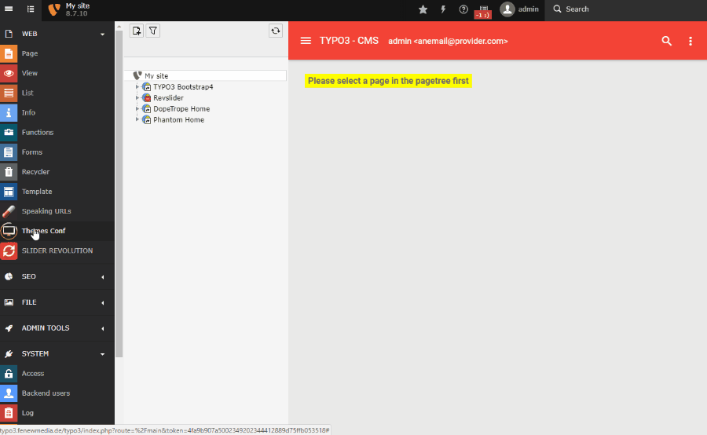

.. ==================================================
.. FOR YOUR INFORMATION
.. --------------------------------------------------
.. -*- coding: utf-8 -*- with BOM.

.. include:: ../Includes.txt

.. _users-manual:

Users manual
============

1. Install the extension from the TER.
2. Include the typoscript static templates & pageTS templates.
3. Use the ThemesConf Module to set up your default settings on your Rootpage.

Add some content and visit your frontend!

**Theme Conf Module**

	Walkthrough Theme Conf Module
